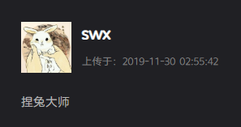
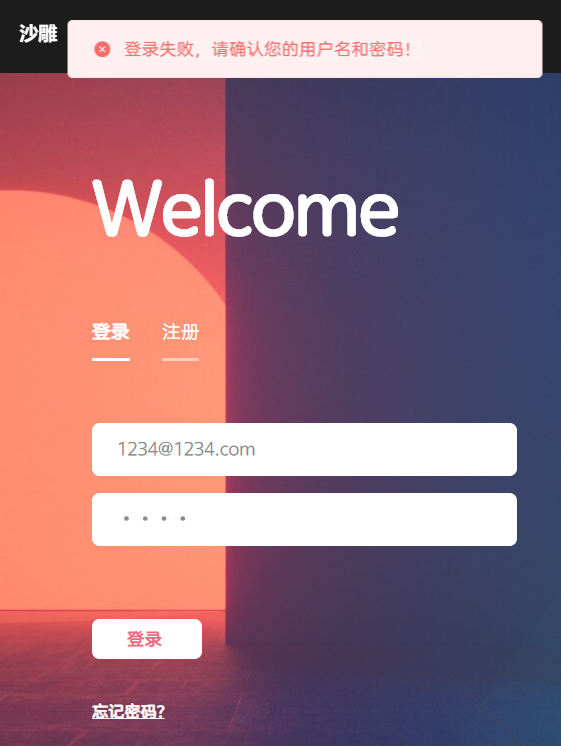

**DAM User Menu - Group 2**

廖钰 / 赵浩钧 / 诸炳帆 / 林馨怡 / 孙文欣

---

# 目录

- [用户菜单](#用户菜单)
  - [主要界面](#主要界面)
  - [账号管理](#账号管理)
- [管理员菜单](#管理员菜单)

# 用户菜单

## 主要界面

### 导航栏

通过导航栏可以访问主页、分类页，登录状态下可访问用户推荐页、上传页、我的上传页和我的收藏页；可以进行全局搜索，以及登录、注册、注销、设置等账号操作：

### 主页

通过主页您可快速浏览当下最热门的10张表情包，及各分类的4张热门表情包：

点击 Hot10 表情包，可进入表情包详情页：

表情包右上角的三个图标表示详情、点赞、收藏，收藏的图片将收录在您的收藏页；下方悬浮的是该图片对应的分类和标签：

### 分类页

选择导航栏上的一种分类，或直接点击表情包下方的分类标签，可进入分类页。分类页为您呈现该分类下的热门图片：

### 猜你喜欢

登录状态下，点击导航栏中的“猜你喜欢”，您将看到我们根据您的喜好为您推荐的精彩表情包：

### 搜索页

在导航栏的搜索框上进行全局搜索：

### 表情详情页

在表情包详情页，您能看到这张图片的详细上传信息，并对图片进行点赞、收藏、下载：

甚至能对涉嫌违禁图片进行举报：

### 上传页

上传自己的表情包，为它添加分类和标签：

选择是否为您的表情添加水印，水印将是您的用户名：

另外，您也可以设置这些图片是否同步到广场，否则将仅自己可见：

### 我的上传

您上传的表情包将被收集到该界面，您可以在这里进行局部搜索：

【截图，搜索结果】
?

也可以删除上传的表情包：

### 我的收藏

你收藏的表情包将被收集到该界面，您可以在这里进行局部搜索：

当然也可以取消收藏，就像其他页面一样：

### 其他用户页

您可以从表情详情页访问上传者的个人主页：

如果他进行了私密设置，您将无法访问：

## 账号管理

### 注册

未登录状态下，点击页面右上角的注册按钮进入注册页。输入您的注册账号的用户名、登录邮箱和密码，点击注册按钮：

若该邮箱未被注册，则注册成功，跳转“我的上传”页：

若该邮箱被注册，则有错误提示：

### 登录

未登录状态下，点击页面右上角的登录按钮进入登录页。输入您的登录邮箱和密码，点击登录按钮：

若密码正确，则登录成功，跳转到“我的上传”页：

若密码与账号不符，则有错误提示：

### 注销

登录状态下，点击页面右上角的下拉菜单，选择“退出登录”：

注销成功，回到未登录状态：

### 设置

登录状态下，点击下拉菜单，选择“个人设置”，进入设置页

#### 个人信息

您可以修改您的用户名、简介、头像和主页隐私状态，点击确认提交：

在“我的上传”页可以看到您的信息已产生了修改：

#### 修改密码

输入新旧密码、确认密码，点击确认提交：

---

# 管理员菜单

### 登录

登录管理员账号：111@111.com，密码为：111

### 举报审核

在菜单栏中进入审核页面，内含被用户举报的图片：

点击违规图片上悬浮的删除按钮，删除违规图片：

【截删除后的页面，剩下一些非违规图片】

